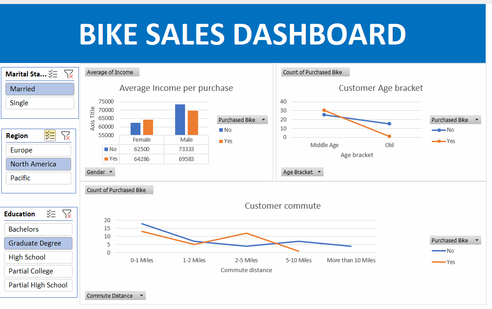

# 🚴‍♂️ Bike Sales Analysis — Excel

**[Click here to explore the live visualization](https://1drv.ms/x/c/99ebc07029dec733/Eab3F10WOK1Asm4FI6c8KXwBy2m1q0LMbHJ8n1D0LvbwIg?e=4IEThv)** 

Dive into the filters, hover for tooltips, and drill down on any segment to see exactly what’s driving bike sales.

## Overview
This project analyzes bike purchase behavior using Excel to uncover who buys, what influences conversion, and how income, age, education, and commute distance relate to purchases. It includes a clean, interactive dashboard powered by PivotTables, PivotCharts, Slicers, and optional Power Query for refreshable data prep.

---

## Dataset
- **Source:** “Bike Buyers”, company data
- **Key fields:** CustomerID, Gender, Marital Status, Education, Occupation, Income, Age, Region, Commute Distance, Children, Purchased Bike (Yes/No).

---

## Tools and Techniques
- **Excel features:** PivotTables, PivotCharts, Slicers, Timelines, Conditional Formatting.
- **Data cleaning:** Power Query for types, trimming text, deduping; Data Validation for categories.
- **Formulas:** Dynamic arrays (FILTER, UNIQUE), XLOOKUP, TEXT/DATE functions for bucketing.
- **Dashboard design:** KPI cards, segmented bars, trend lines, and distribution charts with slicers for Region, Education, Gender, and Marital Status.

---

## Methodology
1. **Data preparation**
   - **Cleaning:** Standardized categorical values, converted data types, removed duplicates by CustomerID.
   - **Bucketing:** Created Age Groups (e.g., Young, Middle‑Aged, Senior) and Income Bands.
2. **Feature engineering**
   - **Commute tiers:** 0–1, 1–2, 2–5, 5–10, >10 miles.
   - **Household context:** Children flag/count and marital status groupings.
3. **Analysis**
   - **Descriptive views:** Purchase rate by demographics, region, and commute distance.
   - **Behavioral patterns:** Income vs. purchase, age vs. purchase, commute vs. purchase.
4. **Dashboard**
   - **Interactivity:** Global slicers (Region, Education, Gender, Marital Status).
   - **Visuals:** Conversion rate by segment, income comparison, age trends, commute distribution.

---

## Dashboard and Usage
- **Files**
  - **Workbook:** [Bike_Sales_Analysis.xlsx] with Data, Model, and Dashboard sheets.
  - **Data source:** company bike sales data
- **How to use**
  - **Explore:** Use slicers for Region, Education, Gender, Marital Status; hover charts for tooltips.
  - **Drill‑down:** Double‑click Pivot values to view underlying customer rows.

---

## Results and Insights
- **Income effect:** Purchasers earn ₦X more on average than non‑purchasers.
- **Age pattern:** Middle‑Aged group shows highest conversion; Seniors lowest.
- **Commute signal:** Strongest purchase intent at 2–5 miles; drop‑off beyond 10 miles.
- **High‑yield segment:** Married, Graduate degree, 2–5 mile commute in North America.
  
- **Recommendations**
  - **Targeting:** Focus campaigns on segments with highest lift.
  - **Offer design:** Bundle accessories for 2–5 mile commuters; financing for high‑income prospects.
  - **Channels:** Use regional promotions where conversion outperforms overall rate.

## Attribution and Contact
**Author:** Augustine Nwenewor

**Connect:** [LinkedIn](https://www.linkedin.com/in/augustine-nwenewor/), [Email](mailto:nwenewoaugustine22@gmail.com)

License: [MIT].
